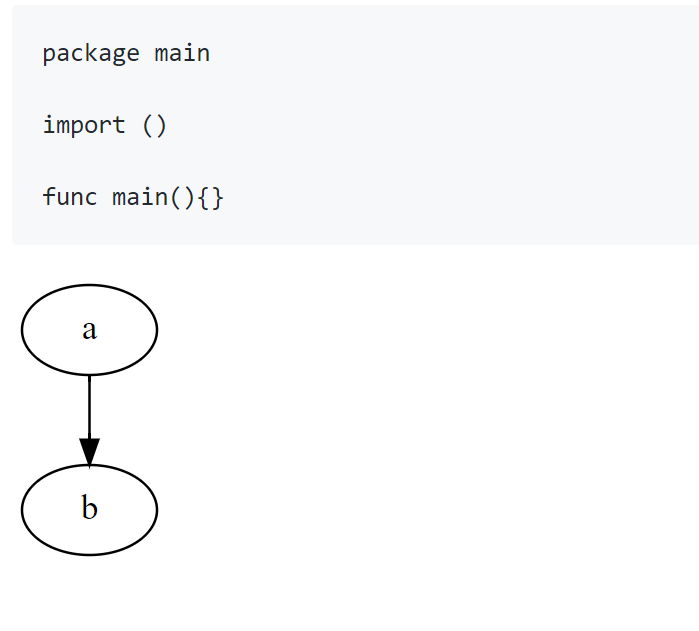
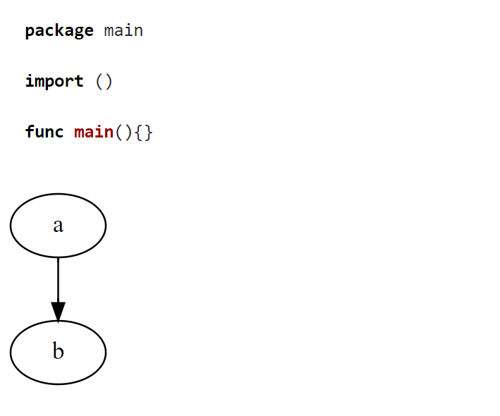

# goldmark-dot

goldmark-dot is an extension for [goldmark](https://github.com/yuin/goldmark).  

You can dot language to build svg image in your markdown like [mume](https://github.com/shd101wyy/mume)

## screenshot

There are two demo(using `'` instead of &#8242; in the code block)

1. default config

```markdown
'''go
package main

import ()

func main(){}
'''

'''dot
digraph{a->b}
'''
```



2. using `dot-svg` and [goldmark-highlighting extension](https://github.com/yuin/goldmark-highlighting)

```markdown
'''go
package main

import ()

func main(){}
'''

'''dot-svg
digraph{a->b}
'''
```



## Installation

```bash
go get -u github.com/OhYee/goldmark-dot
```

## Sage

```go
package main

import (
	"bytes"
	"fmt"
	"github.com/OhYee/goldmark-dot"
	"github.com/yuin/goldmark"
	// "github.com/yuin/goldmark-highlighting"
	"github.com/yuin/goldmark/extension"
	"github.com/yuin/goldmark/parser"
)

func main() {
	var buf bytes.Buffer
	source := []byte("```go\npackage main\n\nimport ()\n\nfunc main(){}\n```\n\n```dot\ndigraph{a->b}\n```\n\n")

	md := goldmark.New(
		goldmark.WithExtensions(
			extension.GFM,
			dot.Dot, // or dot.NewDot("dot-svg", highlighting.NewHTMLRenderer()),
		),
		goldmark.WithParserOptions(
			parser.WithAutoHeadingID(),
		),
		goldmark.WithRendererOptions(),
	)

	if err := md.Convert(source, &buf); err != nil {
		panic(err)
	}
	fmt.Printf("%s\n", buf.Bytes())
}
```

## License

[MIT](LICENSE)